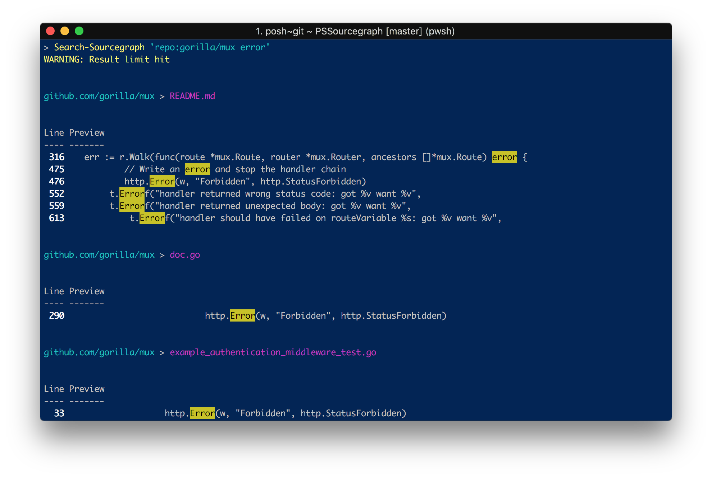

# Sourcegraph for PowerShell

[](https://www.powershellgallery.com/packages/PSSourcegraph)
[](https://www.powershellgallery.com/packages/PSSourcegraph)
[](https://travis-ci.org/sourcegraph/PSSourcegraph)

Search Sourcegraph from PowerShell




Pretty formatting is supported for text, file and symbol results (`type:file` and `type:symbol`)

## Installation

```powershell
Install-Module PSSourcegraph
```

## Included

- `Search-Sourcegraph`
- `Disable-SourcegraphRepository`
- `Enable-SourcegraphRepository`
- `Get-SourcegraphRepository`
- `Get-SourcegraphUser`
- `New-SourcegraphUser`
- `Invoke-SourcegraphApiRequest`

Missing something? Please file an issue!

## Configuration

You can configure a default endpoint and token to be used by modifying `$PSDefaultParameterValues` in your `$PROFILE`:

```powershell
$PSDefaultParameterValues['*Sourcegraph*:Token'] = '5c01fd47a2b2187c2947f8a2eb76b358f3ed0e26'
$PSDefaultParameterValues['*Sourcegraph*:Endpoint'] = 'https://sourcegraph.example.com'
```
